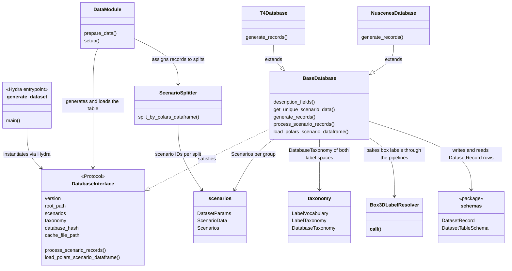

# Database Design

A database describes one corpus: the scenario lists of every dataset it holds, the taxonomy
its labels are baked with, and the box pipelines applied to every sample. From that
description it generates a record table, a parquet file with one row per sample, named after
the hash of the description, and reads the table back for training. The same scenario lists
decide which records belong to train, val and test.

## Architecture Overview



## Core Components

### DatabaseInterface

`DatabaseInterface` is the protocol every database satisfies. Training and the generation
entrypoint depend on it alone: the version, the root path the record paths resolve against,
the scenarios of every scenario group, the taxonomy, the database hash, the record table
file, and the calls that generate and load the table.

### BaseDatabase

`BaseDatabase` implements everything that does not depend on the annotation format. It holds
the database definition, derives the hash and the cache file from it, deduplicates the
scenarios across groups, runs the record generators in worker processes, writes the table
when it does not exist yet and reads it back. A dataset family subclasses it and implements
`generate_records()`, which turns the scenario data into `DatasetRecord` objects. See
[T4Dataset](t4dataset.md) for the T4 implementation. The nuScenes database follows the same
shape over the nuScenes devkit and its official scene splits.

### Scenarios

`DatasetParams` carries the parameters of one dataset: its name, the number of preceding
lidar frames stored per sample, the sampling step, the point feature count of its point
clouds, and whether only the samples carrying a semantic mask are kept. `ScenarioData`
identifies one scenario with its version and the parameters of its dataset. `Scenarios` is
the base that a dataset family extends to build the scenario data of every split, and every
object has a deterministic string form because the database hash is built from it.

### Taxonomy

The database owns the label spaces of its corpus. A `LabelVocabulary` maps every raw label
name of the dataset family onto a fine label name, the finest distinction the corpus supports.
A `LabelTaxonomy` selects the classes trained at one level of granularity and folds every fine
name onto one of them or drops it, so a level is a strict coarsening of the vocabulary and
two levels never drift apart in how they read the raw labels. A `DatabaseTaxonomy` pairs the
detection and the segmentation taxonomy of one level. Levels are config groups under
`configs/database/<family>/taxonomy/`, a database config binds one of them and a task
overrides the binding when it trains another level. The dataset packages read their class
lists from the bound taxonomy, so the metrics, the models, the record table and the mask
loading share one definition.

Box labels are baked when the records are generated. The `Box3DLabelResolver` resolves the
raw name of every box to its fine name, runs the box pipelines on the fine names, and assigns
the class index of the level. Every table stores the fine name in `box3d_label_name` and the
level index in `box3d_label_index`, so the finest label stays available whatever level the
table was baked for, and a box outside the level takes the ignore index. A pipeline whose
behaviour depends on label names validates the taxonomy: the trailer merger rejects a level
that trains trailer as a class of its own. Masks are not baked, the loading transform
resolves the category names of the record through the segmentation taxonomy of the same
database. Training reads the stored index as it is and only drops ignored boxes and the
configured class and attribute exclusions. Every database of a datamodule must carry the same
taxonomy, a rehearsal corpus baked at another level is rejected at construction.

### Record table

The table of a database is `<cache_path>/<cache_file_prefix_name>_<database_hash>.parquet`.
The hash covers the whole database definition, scenario lists, taxonomy, pipelines and
generation parameters, together with the table schema, so a change to any of them selects a
new file and a stale table is never read. Generation skips an existing table and loading a
missing one fails. Tables live below `cache_root_path`, a writable mount separate from the
data mount, so the data mount can stay read only:

```bash
./docker/container.sh --records-path /my/records   # or AUTOWARE_ML_RECORDS_PATH
```

### Splits and sources

`ScenarioSplitter` assigns the records of a database to train, val and test by the scenario
IDs of its scenario lists and rejects a scenario listed in two splits. The `DataModule`
declares its dataset sources per split. A source pairs a database with its supervision
coverage and a repeat factor, so a split can mix corpora with different labels. On
`prepare_data` the datamodule generates the table of every database that has none, and on
`setup` it loads each table once, splits it and assigns the records to the split datasets.

### Dataset Generation (Hydra entrypoint)

Training generates a missing table itself. To build it ahead of time, run the generation
entrypoint with a config from `autoware_ml/configs/generators/`:

```bash
autoware-ml generate-dataset --config-name default_t4dataset_generator database.num_workers=32
```

Every remaining argument is a Hydra override. The scenario lists are read from the
perception-devops checkout below `working_dir`, and the table is written below
`cache_root_path`.

## Extending the Database

| Extension Point     | How                                                                                                   |
| ------------------- | ----------------------------------------------------------------------------------------------------- |
| New dataset family  | Subclass `BaseDatabase`, implement `generate_records()`, add a config group under `configs/database/` |
| New scenario format | Subclass `Scenarios`, implement `build_scenarios()` to parse the format specific lists                |
| New corpus          | Add a scenario group config and a database config naming it                                           |
| New schema columns  | See [Dataset Schema](schemas.md)                                                                      |

## Implementation

| Path                                                    | Description                                   |
| ------------------------------------------------------- | --------------------------------------------- |
| `autoware_ml/databases/database_interface.py`           | `DatabaseInterface` protocol                  |
| `autoware_ml/databases/base_database.py`                | Shared `BaseDatabase` implementation          |
| `autoware_ml/databases/scenarios.py`                    | `DatasetParams`, `ScenarioData`, `Scenarios`  |
| `autoware_ml/databases/taxonomy.py`                     | Vocabulary and taxonomy of the label spaces   |
| `autoware_ml/databases/schemas/`                        | Table and nested data model definitions       |
| `autoware_ml/databases/box3d_pipelines/`                | Label resolver and box pipelines              |
| `autoware_ml/databases/t4dataset/`                      | T4dataset database, scenarios and generator   |
| `autoware_ml/databases/nuscenes/`                       | nuScenes database, scenarios and generator    |
| `autoware_ml/datamodule/splitters/scenario_splitter.py` | Split assignment by scenario lists            |
| `autoware_ml/scripts/generate_dataset.py`               | Hydra entrypoint for table generation         |
| `autoware_ml/configs/database/`                         | Database, scenario group and pipeline configs |
| `autoware_ml/configs/generators/`                       | Entrypoint configs for table generation       |
