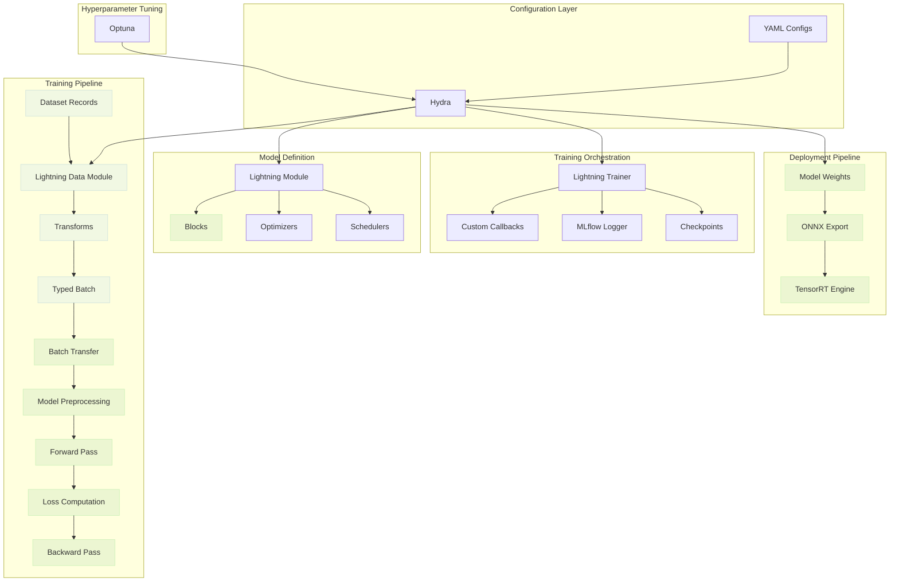

# Framework Design

Autoware-ML is built on a modular architecture that separates concerns into key components including configuration, data handling, model definition, training, and deployment, among others. This design makes it easy to add new models and datasets while reusing common infrastructure.

## Architecture Overview



**Legend:** <span style="display: inline-block; width: 12px; height: 12px; background-color: #42a5f5; border: 1px solid #1976d2; margin-right: 4px; vertical-align: middle;"></span> CPU operations | <span style="display: inline-block; width: 12px; height: 12px; background-color: #66bb6a; border: 1px solid #388e3c; margin-right: 4px; vertical-align: middle;"></span> GPU operations

## Core Components

### Configuration (Hydra)

Everything in Autoware-ML is configured through YAML files processed by [Hydra](https://hydra.cc/). This enables:

- **Hierarchical configs** - Inherit from base configs, override specific values
- **Runtime overrides** - Change any parameter from the command line
- **Automatic instantiation** - `_target_` keys specify Python classes to instantiate via `hydra.utils.instantiate()`

See [Configuration Guide](../user-guide/configuration.md) for full details on Hydra syntax.

### Data Module

Data flows from databases. A database owns one corpus, generates its dataset records once, and
caches them as a parquet table. The datamodule splits the records with a scenario splitter and
serves them through one dataset class per dataset family. A `DatasetSource` pairs a database
with its supervision coverage, so one datamodule can mix corpora with different labels.

```python
class DataModule(L.LightningDataModule):
    def __init__(
        self,
        dataset: Callable[..., Dataset],
        sources: Sequence[DatasetSource],
        splitter: SplitterInterface,
        train_transforms: TransformsCompose | None = None,
        val_transforms: TransformsCompose | None = None,
        test_transforms: TransformsCompose | None = None,
        predict_transforms: TransformsCompose | None = None,
        train_dataloader_cfg: DataLoaderConfig | None = None,
        val_dataloader_cfg: DataLoaderConfig | None = None,
        test_dataloader_cfg: DataLoaderConfig | None = None,
        predict_dataloader_cfg: DataLoaderConfig | None = None,
        train_frame_sampling: FrameSamplingConfig | None = None,
    ):
        ...

    @staticmethod
    def collate_fn(samples: list[Sample]) -> Batch:
        ...
```

The dataset seeds a typed `Sample` from one record and runs the transform pipeline on it. Every
task field of a sample is optional, one dataset class serves detection, segmentation, multiview,
and calibration workloads:

```python
class Dataset(TorchDataset, ABC):
    def __getitem__(self, index: int) -> Sample:
        sample = self.build_seed_sample(index)
        context = PipelineContext(dataset=self, index=index)
        return self.apply_transforms(sample, self.dataset_transforms, context)

    @abstractmethod
    def build_meta(self, record: DatasetRecord) -> FrameMeta:
        ...
```

A seed sample carries only the record and the frame metadata. File loading and sample
materialization happen in transforms. Collation is fixed: `Batch.collate` turns a list of
samples into the typed `Batch` the models consume, and model family specific layouts are
derived later by the runtime preprocessing on the target device.

### Transforms

Transforms are composable data operations applied per sample on CPU. Every transform maps a
typed `Sample` to a new `Sample` and never mutates its input. Loading transforms read the
dataset record of the sample, augmentations rebuild the task fields through the copy helpers of
the sample models. Filtering and reordering of points go through the sample so aligned fields
such as segmentation labels stay consistent by construction.

```python
class BaseTransform(ABC):
    def __call__(self, sample: Sample, context: PipelineContext | None = None) -> Sample:
        self._context = context           # accessible via self.context property
        self._validate_required_fields(sample)
        if not self._should_apply():
            return self.on_skip(sample)
        return self.transform(sample)

    @abstractmethod
    def transform(self, sample: Sample) -> Sample:
        ...

class TransformsCompose:
    def __init__(self, pipeline: Sequence[BaseTransform] = ()):
        self.pipeline = list(pipeline)

    def __call__(self, sample: Sample, context: PipelineContext | None = None) -> Sample:
        for transform in self.pipeline:
            sample = transform(sample, context=context)
        return sample
```

Transforms are configured per split (train/val/test/predict) in the `DataModule` and applied during `Dataset.__getitem__()`.

Public transform targets should reference the concrete implementation module, for example
`autoware_ml.transforms.point_cloud.sweeps.LoadPointsFromMultiSweeps` or
`autoware_ml.transforms.point_cloud.geometry.RandomFlip3D`. Avoid package-level re-export layers in
`__init__.py`; imports and Hydra `_target_` paths should point at the implementation module directly.

### Runtime Data Preprocessing

Runtime preprocessing is a model-owned pipeline attached through
`BaseModel.set_data_preprocessing(...)`. It runs on the target device after Lightning moves the
batch over, and before the model's `forward()`. Every layer derives one typed `ModelInputs`
from the batch, for example voxel grids or frustum projections, and the pipeline wraps the
batch together with the derived inputs into a `ProcessedBatch`.

```python
class DataPreprocessing:
    def __init__(self, pipeline: Sequence[Any] = ()):
        self.pipeline = list(pipeline)

    def __call__(self, batch: Batch, *, is_training: bool) -> ProcessedBatch:
        derived = [layer(batch, is_training=is_training) for layer in self.pipeline]
        return ProcessedBatch(batch=batch, inputs=tuple(derived))
```

`BaseModel.on_after_batch_transfer()` applies the pipeline. Output-side shaping (for example
logits to probabilities, voxel-to-point scatter) lives **inside the model**, not in a framework
pipeline: each model handles it in its own `forward()`, `compute_metrics()`, and
`predict_outputs()`. Keeping this logic in the model class avoids invisible load-bearing
dependencies between config composition and metric correctness.

### Model

All supported models inherit from `BaseModel` (extending `LightningModule`),
which provides a standard interface and a set of override hooks for
task-specific behavior:

```python
class BaseModel(L.LightningModule, ABC):
    def __init__(
        self,
        optimizer: Callable[..., Optimizer] | None = None,
        scheduler: Callable[[Optimizer], LRScheduler] | None = None,
    ):
        super().__init__()
        self.forward_signature = inspect.signature(self.forward)
        ...

    @abstractmethod
    def forward(self, **kwargs: Any) -> torch.Tensor | Sequence[torch.Tensor]:
        ...

    @abstractmethod
    def compute_metrics(
        self, processed: ProcessedBatch, outputs: Any
    ) -> dict[str, torch.Tensor]:
        ...

    def set_data_preprocessing(self, data_preprocessing: DataPreprocessing) -> None:
        ...

    def predict_outputs(self, processed: ProcessedBatch | None, outputs: Any) -> Any:
        ...

    def build_export_spec(self, processed: ProcessedBatch) -> ExportSpec:
        ...

    def configure_optimizers(self) -> Optimizer | dict[str, Any]:
        ...
```

The base class handles:

- **Unified step logic** - All models share the same training, validation, test, and predict execution path
- **Typed parameter binding** - Every `forward()` parameter resolves by name against the derived model inputs first and the flat batch properties second, and a required parameter that resolves to nothing raises immediately
- **Runtime data preprocessing** - Applies the model-owned preprocessing pipeline after batch transfer
- **Metric logging** - Logs metrics to Lightning's logger with proper prefixes
- **Predict step** - Runs forward and formats predictions via `predict_outputs()`
- **Export contract** - Supports a generic forward-signature-based export path and model-owned explicit export wrappers

Models can have **any internal architecture**. Specialized models override hooks such as
`predict_outputs()`, `set_data_preprocessing()`, or `build_export_spec()` without leaving the
shared framework contract.

!!! note
    `forward()` argument names must match fields of the derived model inputs or properties of
    the typed batch. Models with more specialized batching or export requirements should
    override the relevant hooks instead of bypassing `BaseModel`.

### Deployment Pipeline

The deployment pipeline exports trained models to production-ready formats:

```mermaid
flowchart LR
    subgraph ONNXExport [ONNX Export]
        Checkpoint[Checkpoint] --> Load[Load Weights]
        Load --> Model[Model Eval Mode]
        Model --> Trace[Trace with Sample]
        Trace --> ONNX[ONNX File]
    end

    subgraph TensorRTBuild [TensorRT Build]
        ONNX --> Parse[Parse ONNX]
        Parse --> Optimize[Build Engine]
        Optimize --> EngineFile[Engine File]
    end

    style Checkpoint fill:#a5d6a7,opacity:0.2,stroke:#05bc23
    style Load fill:#a5d6a7,opacity:0.2,stroke:#05bc23
    style Model fill:#a5d6a7,opacity:0.2,stroke:#05bc23
    style Trace fill:#a5d6a7,opacity:0.2,stroke:#05bc23
    style ONNX fill:#a5d6a7,opacity:0.2,stroke:#05bc23
    style Parse fill:#a5d6a7,opacity:0.2,stroke:#05bc23
    style Optimize fill:#a5d6a7,opacity:0.2,stroke:#05bc23
    style EngineFile fill:#a5d6a7,opacity:0.2,stroke:#05bc23
```



The deployment process:

1. **Load checkpoint** - Instantiates model from config and loads weights from checkpoint
2. **Get input sample** - Uses the predict dataloader to obtain a preprocessed sample for deployment
3. **Resolve export spec** - Builds the effective export module and example inputs through the model's `build_export_spec()` contract
4. **Export to ONNX** - Traces the resolved export module, supporting dynamic shapes for variable input sizes
5. **Build TensorRT engine** - Optimizes the ONNX model for inference on NVIDIA GPUs with configurable optimization profile

Configuration is done through the `deploy` section in task configs.

## Extending the Framework

| Extension Point | How                                                                                           |
| --------------- | --------------------------------------------------------------------------------------------- |
| New model       | Subclass `BaseModel`, implement `forward()` and `compute_metrics()`, override hooks as needed |
| New dataset     | Add a database with a records generator, subclass `Dataset` with its `build_meta()`           |
| New transform   | Subclass `BaseTransform`, implement `transform()`                                             |
| New task        | Create config in `configs/tasks/`                                                             |

See [Adding Models](../contributing/adding-models.md) for a detailed guide.
